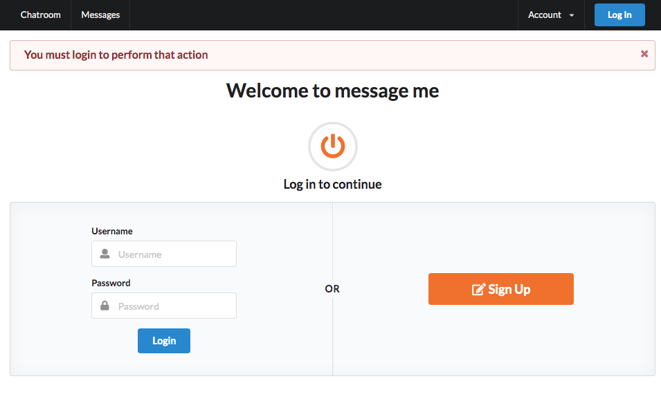
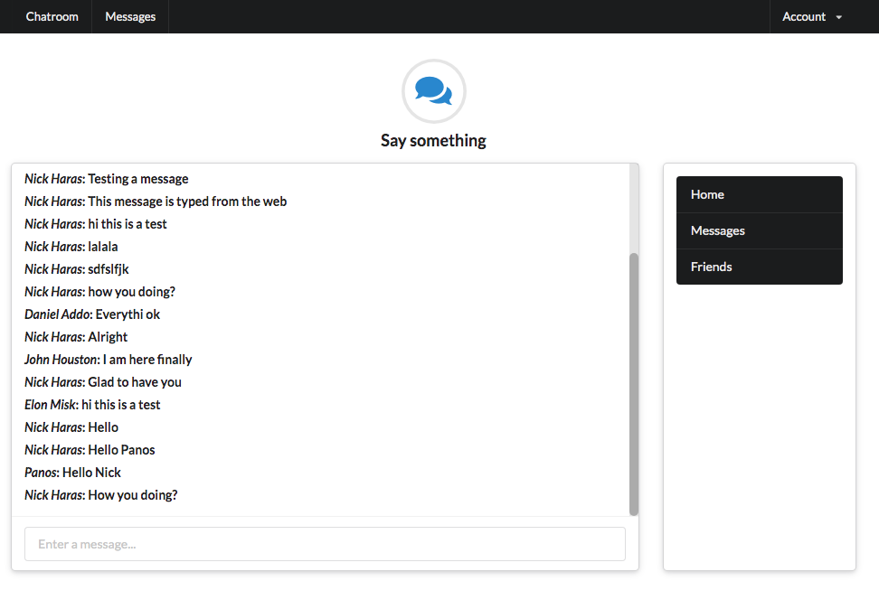

# MessageMe chat application

This is the MessageMe app from the Complete Ruby on Rails Developer course. It uses Rails 5 Actioncable for real time chatting. Also Semantic UI for styling. The messages appear to all logged in users without refreshing their browsers.

### Screenshots



After user logs in



### Requirements

```
- Ruby 2.6.4
- Ruby on Rails 5.2.3
- A basic familiarity with Ruby on Rails
```

### Installation

Clone or download this repository to your local machine. After cloning open your terminal on the repository folder and run

```
bundle install
rails db:create
rails db:migrate
```

👤 **Contact details**

- Github: [@macnick](https://github.com/macnick)
- Twitter: [@mac_experts](https://twitter.com/mac_experts)
- Linkedin: [Nick Haralampopoulos](https://www.linkedin.com/in/nick-haralampopoulos-26a55412a/)

## 🤝 Contributing

Contributions, issues and feature requests are welcome!

Feel free to check the [issues page](https://github.com/macnick/facebook-clone/issues).

## Show your support

Give a ⭐️ if you like this project!

## 📝 License

This project is [MiT](LICENSE) licensed.
